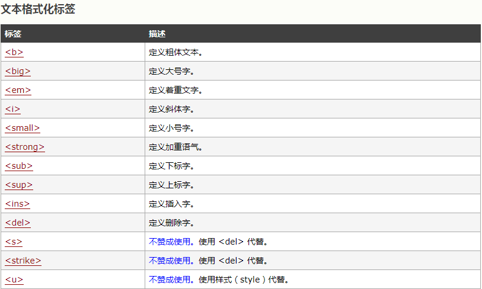
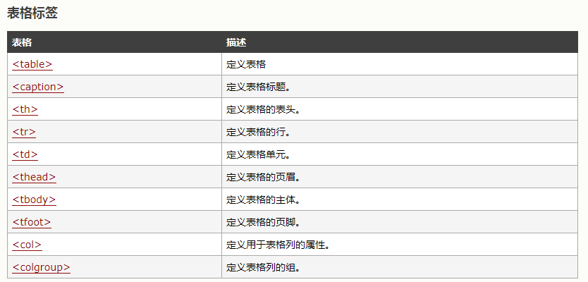
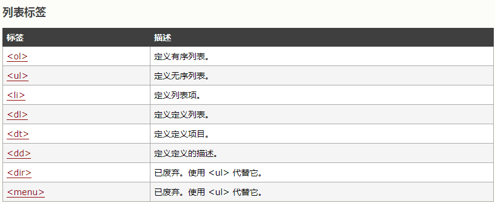

<html>
<head>
<title>HTML</title>
</head>
<body>
<!---注释 --->
<h1>HTML</h1>
<h3>什么是HTML</h3>
<ul>
<li>HTML 是用来描述网页的一种语言。
<li>HTML 指的是超文本标记语言 (Hyper Text Markup Language)
<li>HTML 不是一种编程语言，而是一种标记语言 (markup language)
标记语言是一套标记标签 (markup tag)
<li>HTML 使用标记标签来描述网页
</ul>
<h3>HTML标签</h3>
<pre>
HTML 标记标签通常被称为 HTML 标签 (HTML tag)。
HTML 标签是由尖括号包围的关键词，比如 <html>
HTML 标签通常是成对出现的，比如 <b> 和 </b>
标签对中的第一个标签是开始标签，第二个标签是结束标签
开始和结束标签也被称为开放标签和闭合标签
HTML注释  <\!-- -->
JS注释  //单行   /* 多行 */
html 文档元素
body 文档主体
h1  标题元素   1代表级别  1-6 1大好
p   段落元素
a   链接元素   a href="url">INFO</a  target="_blank" 新窗口打开链接  
<a href="www.baidu.com">go to baidu!</a>
img 图像元素   img src="file_path" />  alt=“string”  图片加载不出来 显示信息
br  换行,空元素       br />
 
hr  折线 例 如下 

q   引用元素  <q> 引号出来 </q>
table  表格元素 

</pre>
<h3 style="background-color:red">HTML属性</h3>
<pre>

<b>style 属性用于改变 HTML 元素的样式，包括了字体的大小 位置 颜色等.</b>

T T

</pre>

<pre>
<h4>HTML表格</h4>
<table>
<th>number</th>
<th>number</th>
<tr>
<td>1</td>
<td>2</td>
</tr>
<tr>
<td>3</td>
<td>4</td>
</tr>
</table>

</pre>

<pre>
<h4>HTML列表（有序，无序）</h4>
<ul><li>ul</li><li>li</li><ul>
<ol><li>ol</li><li>li</li><ol>
<dl>
<dt>自定义列表</dt>
<dd>comment</dd>
<dt>延伸出来咯</dt>
<dd>BANG BANG </dd>
</dl>

</pre>

view-source:url  即可查看对应的html源代码

</html>
</body>